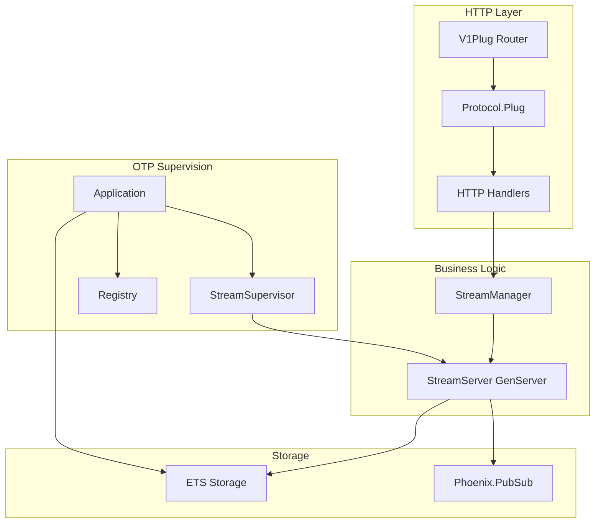
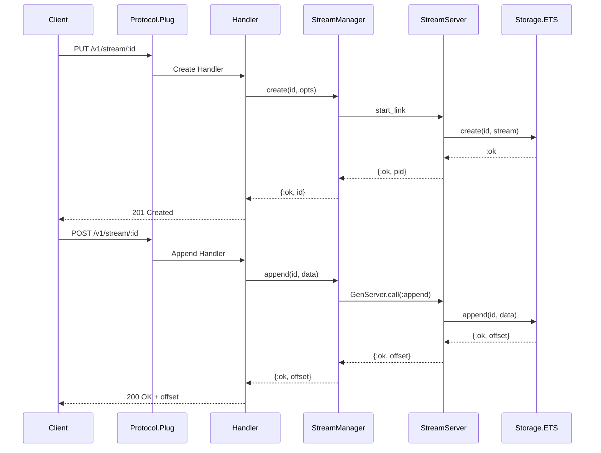
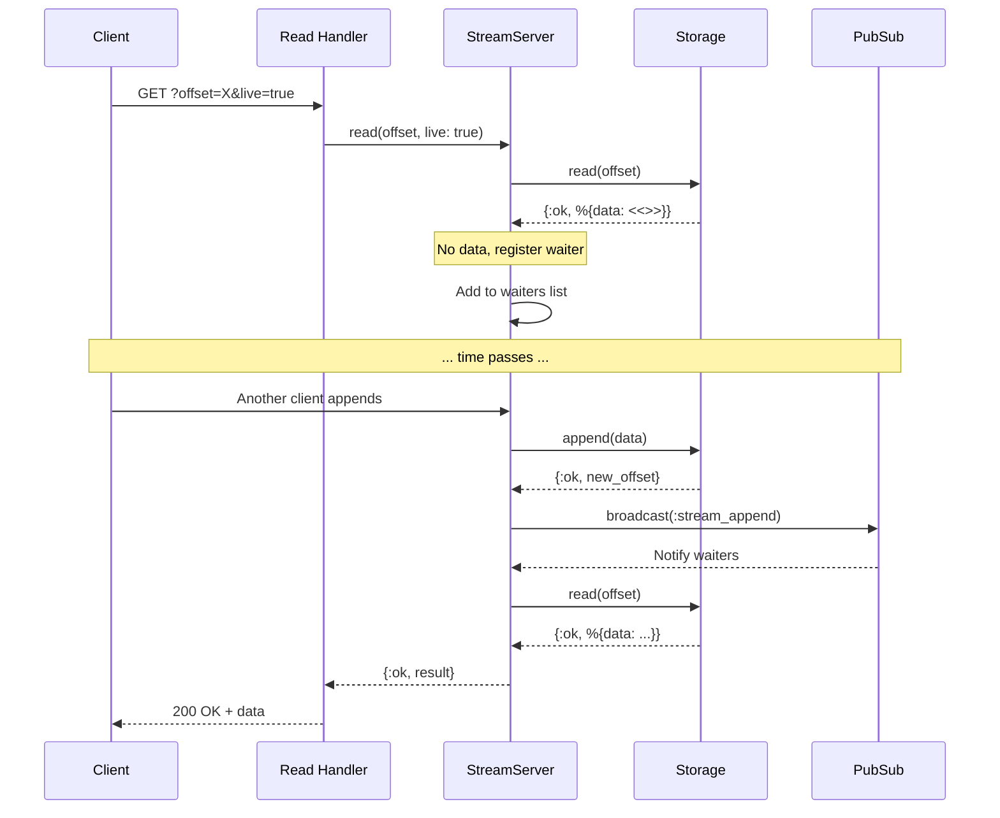
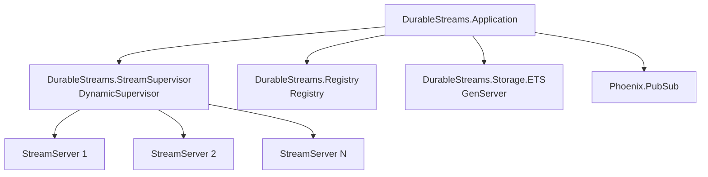

# DurableStreams

An Elixir/OTP implementation of the [Durable Streams](https://github.com/durable-streams/durable-streams) protocol - a specification for append-only, URL-addressable byte logs.

## Features

- Full HTTP protocol compliance (PUT, POST, GET, DELETE, HEAD)
- JSON mode with array flattening
- Long-polling and Server-Sent Events (SSE) for live updates
- Stream TTL and expiration
- Sequence ordering enforcement
- ETag-based caching
- OTP supervision tree for fault tolerance

## Architecture

### Component Overview



### Request Flow



### Long-Polling Flow



## Installation

Add `durable_streams` to your dependencies in `mix.exs`:

```elixir
def deps do
  [
    {:durable_streams, "~> 0.1.0"}
  ]
end
```

## Usage

### Standalone Server

Start the HTTP server on a specific port:

```elixir
# In your application.ex or IEx
{:ok, _} = Plug.Cowboy.http(DurableStreams.Protocol.V1Plug, [], port: 4437)
```

### Phoenix Integration

Forward requests from your Phoenix router:

```elixir
# In your router.ex
forward "/v1/stream", DurableStreams.Protocol.Plug
```

### Programmatic API

Use the `DurableStreams.StreamManager` module directly:

```elixir
# Create a stream
{:ok, "my-stream"} = DurableStreams.StreamManager.create("my-stream",
  content_type: "text/plain",
  ttl: 3600  # expires in 1 hour
)

# Append data
{:ok, offset} = DurableStreams.StreamManager.append("my-stream", "Hello, World!")

# Read data
{:ok, result} = DurableStreams.StreamManager.read("my-stream", "-1")
# result.data => "Hello, World!"
# result.offset => "0006478b4bce37b5-0001-98ee"

# Long-poll for new data
{:ok, result} = DurableStreams.StreamManager.read("my-stream", offset,
  live: true,
  timeout: 30_000
)

# Delete stream
:ok = DurableStreams.StreamManager.delete("my-stream")
```

### JSON Mode

When a stream is created with `content-type: application/json`, it operates in JSON mode:

```elixir
# Create JSON stream
{:ok, _} = DurableStreams.StreamManager.create("json-stream",
  content_type: "application/json"
)

# Arrays are flattened one level
# POST [{"a": 1}, {"b": 2}] stores two messages
{:ok, _} = DurableStreams.StreamManager.append("json-stream",
  Jason.encode!([%{a: 1}, %{b: 2}])
)

# Read returns array of messages
{:ok, result} = DurableStreams.StreamManager.read_messages("json-stream", "-1")
# result.messages => [%{data: "{\"a\":1}", offset: "..."}, ...]
```

## HTTP API

| Method | Path | Description |
|--------|------|-------------|
| `PUT` | `/:stream_id` | Create a stream |
| `POST` | `/:stream_id` | Append data |
| `GET` | `/:stream_id` | Read from offset |
| `DELETE` | `/:stream_id` | Delete stream |
| `HEAD` | `/:stream_id` | Get metadata |

### Headers

#### Request Headers

| Header | Description |
|--------|-------------|
| `Content-Type` | Stream content type (required for POST, optional for PUT) |
| `Stream-TTL` | Time-to-live in seconds |
| `Stream-Expires-At` | ISO 8601 expiration timestamp |
| `Stream-Seq` | Sequence value for ordering |
| `If-None-Match` | ETag for conditional GET |

#### Response Headers

| Header | Description |
|--------|-------------|
| `Stream-Next-Offset` | Offset for resuming reads |
| `Stream-Up-To-Date` | True when no more data available |
| `Stream-Cursor` | Cursor for jitter handling |
| `ETag` | Entity tag for caching |
| `Location` | Stream URL (on 201) |

### Query Parameters

| Parameter | Description |
|-----------|-------------|
| `offset` | Start reading after this offset (-1 for beginning) |
| `live` | Enable long-polling (`true`) or SSE (`sse`) |
| `timeout` | Long-poll timeout in seconds |

## Configuration

The library uses sensible defaults but can be configured:

```elixir
# config/config.exs
config :durable_streams,
  storage: DurableStreams.Storage.ETS,
  default_timeout: 30_000
```

## OTP Supervision Tree



Each stream is managed by its own GenServer process, providing:
- Process isolation
- Independent failure handling
- Concurrent access
- Automatic cleanup on TTL expiration

## Conformance Testing

Run the official [Durable Streams conformance tests](https://github.com/durable-streams/durable-streams) to verify protocol compliance.

### Prerequisites

- Node.js 18+ (for running the conformance test suite)

### Running Tests

```bash
# Install conformance test dependencies (first time only)
cd conformance
npm install
cd ..

# Start the server in one terminal
mix run -e 'Plug.Cowboy.http(DurableStreams.Protocol.V1Plug, [], port: 4437); Process.sleep(:infinity)'

# In another terminal, run conformance tests
cd conformance
npx @durable-streams/server-conformance-tests --run http://localhost:4437
```

Alternatively, use the mix task (starts server automatically):

```bash
mix durable_streams.conformance
```

Current conformance: **131/131 tests passing (100%)**

## License

MIT License
