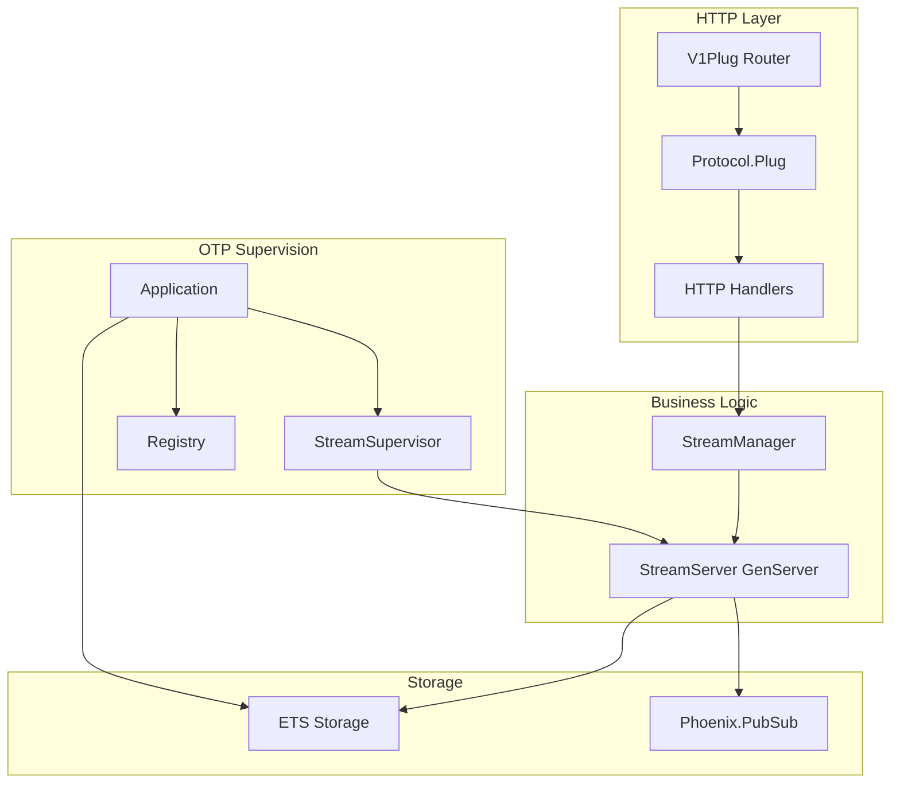
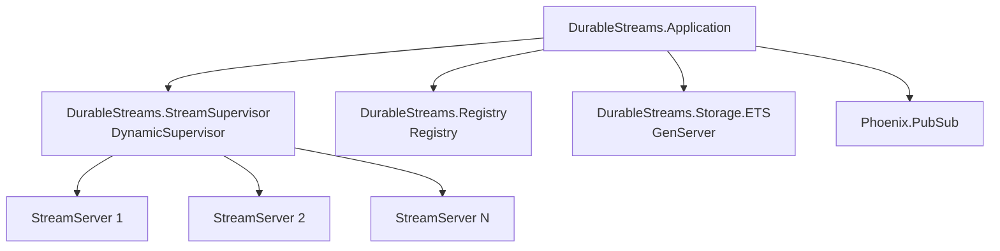
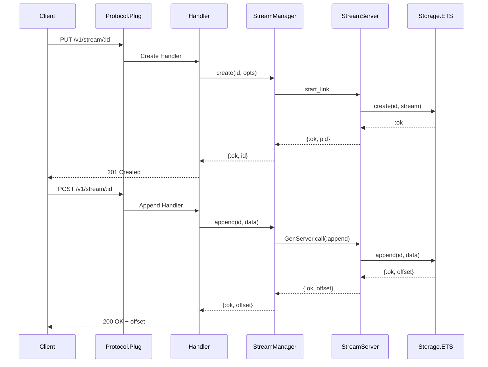
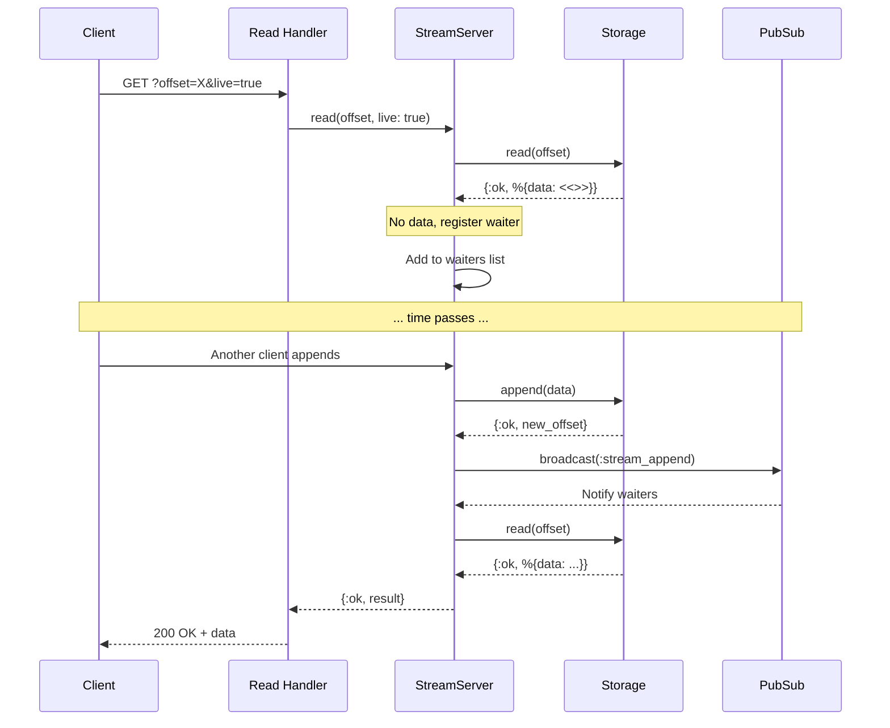

# DurableStreams

[](https://hex.pm/packages/durable_streams)
[](https://hexdocs.pm/durable_streams)

An Elixir/OTP implementation of the [Durable Streams](https://github.com/durable-streams/durable-streams) protocol - a specification for append-only, URL-addressable byte logs.

## Features

- Full HTTP protocol compliance (PUT, POST, GET, DELETE, HEAD)
- JSON mode with array flattening
- Long-polling and Server-Sent Events (SSE) for live updates
- Phoenix LiveView helper module for easy integration
- Stream TTL and expiration
- Sequence ordering enforcement
- ETag-based caching
- OTP supervision tree for fault tolerance

## Requirements

- Elixir 1.15+
- Erlang/OTP 26+

## Installation

Add `durable_streams` to your dependencies in `mix.exs`:

```elixir
def deps do
  [
    {:durable_streams, "~> 0.1.0"},
    # Choose an HTTP server adapter:
    {:plug_cowboy, "~> 2.7"}  # or {:bandit, "~> 1.0"}
  ]
end
```

## Quick Start

### Standalone Server

Start the HTTP server on a specific port:

```elixir
# In your application.ex or IEx
{:ok, _} = Plug.Cowboy.http(DurableStreams.Protocol.V1Plug, [], port: 4437)
```

### Phoenix Integration

DurableStreams integrates seamlessly with Phoenix applications. The library starts its own supervision tree automatically when added as a dependency, so no additional setup is required beyond routing.

**Step 1: Add the dependency**

```elixir
# mix.exs
def deps do
  [
    {:phoenix, "~> 1.7"},
    {:durable_streams, "~> 0.1.0"},
    # ... other deps
  ]
end
```

**Step 2: Add the route**

```elixir
# lib/my_app_web/router.ex
defmodule MyAppWeb.Router do
  use MyAppWeb, :router

  # Your existing pipelines...

  # Forward durable streams requests (no pipeline needed - it handles its own parsing)
  forward "/v1/stream", DurableStreams.Protocol.Plug
end
```

**Step 3: Use it!**

```bash
# Create a stream
curl -X PUT http://localhost:4000/v1/stream/my-stream \
  -H "Content-Type: text/plain"

# Append data
curl -X POST http://localhost:4000/v1/stream/my-stream \
  -H "Content-Type: text/plain" \
  -d "Hello, Phoenix!"

# Read data
curl "http://localhost:4000/v1/stream/my-stream?offset=-1"
```

**Using the programmatic API in Phoenix contexts**

You can also use the `DurableStreams` module directly in your Phoenix controllers, channels, or LiveViews:

```elixir
defmodule MyAppWeb.StreamController do
  use MyAppWeb, :controller

  def create(conn, %{"id" => stream_id}) do
    case DurableStreams.create(stream_id, content_type: "application/json") do
      {:ok, _} -> json(conn, %{status: "created", stream_id: stream_id})
      {:error, :already_exists} -> json(conn, %{status: "exists", stream_id: stream_id})
    end
  end

  def append(conn, %{"id" => stream_id, "data" => data}) do
    {:ok, offset} = DurableStreams.append(stream_id, Jason.encode!(data))
    json(conn, %{offset: offset})
  end
end
```

> **Note:** DurableStreams uses its own Phoenix.PubSub instance (`DurableStreams.PubSub`) which does not conflict with your application's PubSub.

### Phoenix LiveView Integration

For LiveView applications, use the `DurableStreams.LiveView` helper module to handle long-polling with automatic offset tracking and reconnection:

```elixir
defmodule MyAppWeb.EventsLive do
  use Phoenix.LiveView
  alias DurableStreams.LiveView, as: DSLive

  def mount(_params, _session, socket) do
    {:ok, DSLive.init(socket)}
  end

  def handle_event("subscribe", %{"stream_id" => stream_id}, socket) do
    {:noreply, DSLive.listen(socket, stream_id)}
  end

  def handle_event("unsubscribe", _, socket) do
    {:noreply, DSLive.stop(socket)}
  end

  # Handle stream messages
  def handle_info(msg, socket) do
    if DSLive.stream_message?(msg) do
      case DSLive.handle_message(socket, msg) do
        {:data, messages, socket} ->
          {:noreply, process_messages(socket, messages)}

        {:status, _status, socket} ->
          {:noreply, socket}

        {:complete, socket} ->
          {:noreply, assign(socket, :finished, true)}

        {:error, reason, socket} ->
          {:noreply, assign(socket, :error, reason)}
      end
    else
      {:noreply, socket}
    end
  end

  defp process_messages(socket, messages) do
    Enum.reduce(messages, socket, fn msg, acc ->
      update(acc, :events, &[msg.data | &1])
    end)
  end
end
```

**Available functions:**

| Function | Description |
|----------|-------------|
| `init/2` | Initialize stream assigns on socket |
| `listen/3` | Start listening to a stream with offset tracking |
| `stop/1` | Stop the listener, preserve stream ID and offset |
| `reset/1` | Stop and clear all stream state |
| `stream_message?/1` | Check if a message is from the stream listener |
| `handle_message/2` | Process stream messages, returns `{:data, messages, socket}`, `{:status, status, socket}`, `{:complete, socket}`, or `{:error, reason, socket}` |
| `status/1` | Get current status (`:idle`, `:connecting`, `:streaming`, `:disconnected`) |
| `stream_id/1` | Get current stream ID |
| `offset/1` | Get current offset |
| `listening?/1` | Check if actively listening |

The module uses `ds_` prefixed assigns (e.g., `@ds_status`, `@ds_stream_id`, `@ds_offset`) to avoid conflicts with your application's assigns.

> **Note:** Requires `phoenix_live_view` as an optional dependency. The module is only compiled when Phoenix.LiveView is available.

### Programmatic API

Use the `DurableStreams.StreamManager` module directly:

```elixir
# Create a stream
{:ok, "my-stream"} = DurableStreams.StreamManager.create("my-stream",
  content_type: "text/plain",
  ttl: 3600  # expires in 1 hour
)

# Append data
{:ok, offset} = DurableStreams.StreamManager.append("my-stream", "Hello, World!")

# Read data
{:ok, result} = DurableStreams.StreamManager.read("my-stream", "-1")
# result.data => "Hello, World!"
# result.offset => "0006478b4bce37b5-0001-98ee"

# Long-poll for new data
{:ok, result} = DurableStreams.StreamManager.read("my-stream", offset,
  live: true,
  timeout: 30_000
)

# Delete stream
:ok = DurableStreams.StreamManager.delete("my-stream")
```

### JSON Mode

When a stream is created with `content-type: application/json`, it operates in JSON mode:

```elixir
# Create JSON stream
{:ok, _} = DurableStreams.StreamManager.create("json-stream",
  content_type: "application/json"
)

# Arrays are flattened one level
# POST [{"a": 1}, {"b": 2}] stores two messages
{:ok, _} = DurableStreams.StreamManager.append("json-stream",
  Jason.encode!([%{a: 1}, %{b: 2}])
)

# Read returns array of messages
{:ok, result} = DurableStreams.StreamManager.read_messages("json-stream", "-1")
# result.messages => [%{data: "{\"a\":1}", offset: "..."}, ...]
```

## HTTP API

| Method | Path | Description |
|--------|------|-------------|
| `PUT` | `/:stream_id` | Create a stream |
| `POST` | `/:stream_id` | Append data |
| `GET` | `/:stream_id` | Read from offset |
| `DELETE` | `/:stream_id` | Delete stream |
| `HEAD` | `/:stream_id` | Get metadata |

### Request Headers

| Header | Description |
|--------|-------------|
| `Content-Type` | Stream content type (required for POST, optional for PUT) |
| `Stream-TTL` | Time-to-live in seconds |
| `Stream-Expires-At` | ISO 8601 expiration timestamp |
| `Stream-Seq` | Sequence value for ordering |
| `If-None-Match` | ETag for conditional GET |

### Response Headers

| Header | Description |
|--------|-------------|
| `Stream-Next-Offset` | Offset for resuming reads |
| `Stream-Up-To-Date` | True when no more data available |
| `Stream-Cursor` | Cursor for jitter handling |
| `ETag` | Entity tag for caching |
| `Location` | Stream URL (on 201) |

### Query Parameters

| Parameter | Description |
|-----------|-------------|
| `offset` | Start reading after this offset (-1 for beginning) |
| `live` | Enable long-polling (`true`) or SSE (`sse`) |
| `timeout` | Long-poll timeout in seconds |

## Examples

The `examples/` directory contains runnable demonstrations:

### Simple Demo

A command-line script showing core API usage:

```bash
elixir examples/simple_demo.exs
```

Shows stream creation, appending, reading, long-polling, and JSON mode.

### Live Activity Stream

An interactive Phoenix LiveView demonstrating long-polling and resume:

```bash
iex examples/live_activity_stream.exs
# Open http://localhost:4000
```

Try disconnecting and reconnecting — no events are lost!

### LLM Token Streaming

The flagship example demonstrating resumable AI token streaming — the primary use case from the [Durable Streams announcement](https://electric-sql.com/blog/2025/12/09/announcing-durable-streams):

```bash
iex examples/llm_streaming.exs
# Open http://localhost:4000

# Optional: Set API keys for real AI responses (works without them in Demo mode)
export ANTHROPIC_API_KEY=your-key-here
export OPENAI_API_KEY=your-key-here
```

Demonstrates:
- **Resumable streaming** — disconnect mid-response and resume without losing tokens
- **Multi-client broadcast** — multiple tabs watch the same AI response
- **Replay capability** — re-watch responses from the beginning
- **Multi-provider support** — works with Claude, GPT, or Demo mode (no API keys needed)

See [examples/README.md](examples/README.md) for more details.

## Configuration

The library uses sensible defaults but can be configured:

```elixir
# config/config.exs
config :durable_streams,
  storage: DurableStreams.Storage.ETS,
  default_timeout: 30_000
```

## Development

### Setup

```bash
# Clone the repository
git clone https://github.com/errantsky/durable_streams.git
cd durable_streams

# Install dependencies
mix deps.get

# Compile
mix compile
```

### Running Tests

```bash
# Run unit tests
mix test

# Run with coverage
mix test --cover
```

### Conformance Testing

This library passes 100% of the official [Durable Streams conformance tests](https://github.com/durable-streams/durable-streams).

**Prerequisites:**
- Node.js 18+ (for the conformance test suite)

**Running conformance tests:**

```bash
# Option 1: Use the mix task (recommended)
mix durable_streams.conformance

# Option 2: Manual setup
# Install npm dependencies (first time only)
cd conformance
npm install
cd ..

# Start server in one terminal
mix run -e 'Plug.Cowboy.http(DurableStreams.Protocol.V1Plug, [], port: 4437); Process.sleep(:infinity)'

# Run tests in another terminal
cd conformance
npx @durable-streams/server-conformance-tests --run http://localhost:4437
```

**Current conformance: 131/131 tests passing (100%)**

### Code Quality

```bash
# Format code
mix format

# Run static analysis (if credo is installed)
mix credo
```

## Architecture

### Component Overview



### OTP Supervision Tree



Each stream is managed by its own GenServer process, providing:
- Process isolation
- Independent failure handling
- Concurrent access
- Automatic cleanup on TTL expiration

### Request Flow



### Long-Polling Flow



## Protocol Implementation Notes

This library implements the [Durable Streams protocol specification](https://github.com/durable-streams/durable-streams/blob/main/PROTOCOL.md). Below are implementation-specific behaviors and minor differences from the reference specification.

### Cursor Format

The protocol suggests using 20-second time intervals from a fixed epoch for cursor values. This implementation uses millisecond timestamps instead, which still ensures:
- Monotonically increasing values
- Uniqueness across requests
- Proper jitter handling when client echoes cursor back

### Features Not Implemented

| Feature | Status | Notes |
|---------|--------|-------|
| `410 Gone` for dropped offsets | Not implemented | No retention policy; all data is kept until stream deletion |
| `429 Too Many Requests` | Not implemented | Rate limiting is left to infrastructure (reverse proxy, load balancer) |
| `501 Not Implemented` | Not needed | All protocol operations are supported |

### Storage Backend

Currently only ETS (in-memory) storage is provided. For production use with persistence requirements, a custom storage backend implementing `DurableStreams.Storage.Behaviour` should be used.

## License

MIT License - see [LICENSE](LICENSE) for details.
